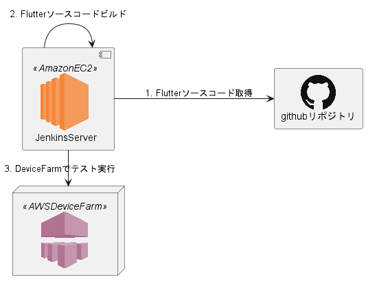

# JenkinsOnEC2

## 概要

[YourFirstFlutterApp](https://github.com/OrangeJuice652/YourFirstFlutterApp)をビルド -> AwsDeviceFarmを使用したUI確認の自動テスト
を行う環境をセットアップするリポジトリ。

## 構成図


上図は、自動テスト環境のインフラ構成図である。
上図の環境は、本リポジトリの[jenkins_on_ec2_setup.yaml](./jenkins_on_ec2_setup.yaml)を使い、CloudFormationで作成できる。


## 作成したJenkinsの自動テストジョブ



上図は、作成したJenkinsで作成した自動テストジョブの流れを示したものである。

1. GITPULLステージ：Flutterソースコードを取得
  1. [YourFirstFlutterAppのリポジトリ](https://github.com/OrangeJuice652/YourFirstFlutterApp)からソースファイル等をプルする。
2. BUILDステージ：Jenkinsサーバー内で、手順1. でプルしたソースコードをビルドする。
3. TESTPARATIONステージ：圧縮テストパッケージファイルを作成
   1. [YourFirstFlutterAppのリポジトリに用意したair_test_packageフォルダ](https://github.com/OrangeJuice652/YourFirstFlutterApp/tree/main/air_test_package)を、圧縮しテストパッケージファイルを作成
      1. 参考：[圧縮テストパッケージファイルを作成する](https://docs.aws.amazon.com/ja_jp/devicefarm/latest/developerguide/test-types-appium.html)
4. TESTステージ：ビルドしたアプリケーション・圧縮テストパッケージファイルをAWSDeviceFarmに送信して、テスト実行。
   1. DrviceFarm内で実行する自動テストについては、[YourFirstFlutterApp](https://github.com/OrangeJuice652/YourFirstFlutterApp)のREADMEに記載。

本ジョブは、`FlutterBuildPipline.xml`をインポートすることで作成できる。

***

## セットアップ手順

AWS環境を作成し、Jenkinsをセットアップするまでの手順を記載する。

1. スタック作成

```
aws cloudformation create-stack --stack-name JenkinsStack --template-body file://<jenkins_on_ec2_setup.yamlのファイルパス>　--parameters ParameterKey=VpcCIDR,ParameterValue=<VPCのCIDER範囲> ParameterKey=PublicSubnet1CIDR,ParameterValue=<パブリックサブネットのCIDER範囲>
```

2. Jenkinsにアクセス

```
URL: http://<EC2のパブリックIP>:8080/
```

Jenkins起動時に、
- Pluginのインストール
- パイプラインのインポート
を自動で行うため※、
GUIでの初期設定は不要。

※ 起動時のスクリプトは、本リポジトリ`groovy`ディレクトリ配下

***

## リポジトリ内のファイル

| ファイル名                        | 役割                                                                                 |
|:------------------------------|:-----------------------------------------------------------------------------------|
| jenkins_on_ec2_setup.yaml     | 構成図に記載したAWS環境を作成するCloudFormationテンプレート                                      |
| user_data.sh                  | EC2起動時に実行されるUserDataスクリプト                                                       |
| aws_device_farm_iam_user.yaml | IAMロール作成用のCloudFormation。作成したIAMロールは、Jenkinsから、DeviceFarmのテスト実行を行うため使用される。 |
| groovy                        | Jenkins起動時に、初期設定※を自動実行するスクリプト。 <br>※プラグインのインストール、ジョブのインポート等                  |
| FlutterBuildPipline.xml       | Jenkins起動時に自動importするJenkinsジョブの定義ファイル。groovy配下のスクリプト内で使用する。             |
| static                        | READMEで使用する画像やplantumlファイル等                                                     |

***

## TODO

### Jenkinsの不具合・改善

- Jenkins内のユーザーをgroovyで作成する。
  - use_data内で、`Djenkins.install.runSetupWizard=false`を設定しているため、認証機能がoffになっている。
    - GUIでのセットアップウィザードではなく、groovyでセットアップを行うため設定した。
  - groovyスクリプト内で、ユーザーを作成し、認証機能をonにする。

- Jenkinsの設定画面（/manage/configure）にあるDeviceFarmプラグイン設定を、groovyで自動設定できるようにする。
  - AKID（アクセスキー）、SKID（シークレットアクセスキー）を設定する。

### README・資料への追記
- AWS構成図に追記
  - 元になったAMI
  - CloudFormationのノード追記
- ファイルの内訳記載
- 途中でDeviceFarmジョブが止まってしまう不具合を書く

## メモ

### スタック削除
```
aws cloudformation delete-stack --stack-name JenkinsStack
```

### Device Farm用のIAMスタックの作成

Jenkinsが、DeviceFarmに、ビルドファイルを送信＆テスト実行させるためにIAMRoleが必要。
`aws_device_farm_iam_user.yaml`を、CloudFormationで実行し作成する。

```
aws cloudformation create-stack --stack-name AWSDeviceFarmUserStack --template-body file://<aws_device_farm_iam_user.yamlのファイルパス> --capabilities CAPABILITY_NAMED_IAM
```

### Jenkinsジョブをエクスポート

既存のJenkinsから、任意のジョブの定義ファイルをエクスポートする。

[参考](https://www.jenkins.io/doc/book/managing/cli/)

1. jenkins-cli.jarを、ローカル環境にダウンロード
  - ダウンロード先：`<JenkinsのURL>/jnlpJars/jenkins-cli.jar`

2. エクスポートするジョブ名を取得
  -  `java -jar ./jenkins-cli.jar -s <JenkinsのURL> -auth <ユーザー名>:<パスワード(環境変数で参照すること推奨)> list-jobs`

3. ジョブの定義ファイルをエクスポート
  -  `java -jar ./jenkins-cli.jar -s <JenkinsのURL> -auth <ユーザー名>:<パスワード(環境変数で参照すること推奨)> get-job > hoge.xml`

### SSH接続手順

CloudFormationで作成したEC2に、SSH接続するためのメモ

1. 作成したKeyPairから、EC2にSSH接続

- [CloudFormationで作成したキーペアを取得＆~/.ssh配下に保存するスクリプト](https://github.com/OrangeJuice652/SaveCloudFormationKeyPair/tree/main)を使用。

 - コマンド
 ```
 ./SaveCloudFormationKeyPair/save_cloudformation_keypair.sh JenkinsStack JenkinsInstanceKeyPairID JenkinsInstanceKeyPair
 ```

- スクリプトを使用しない場合は、~/.ssh配下で、パラメータストア（/ec2/keypair/作成したキーペアID）記載のキー値でキーファイル作成。

2. EC2にssh接続

```
ssh -i "~/.ssh/<手順2.で作成したキーファイル>" ec2-user@<EC2のパブリックIP>
```
