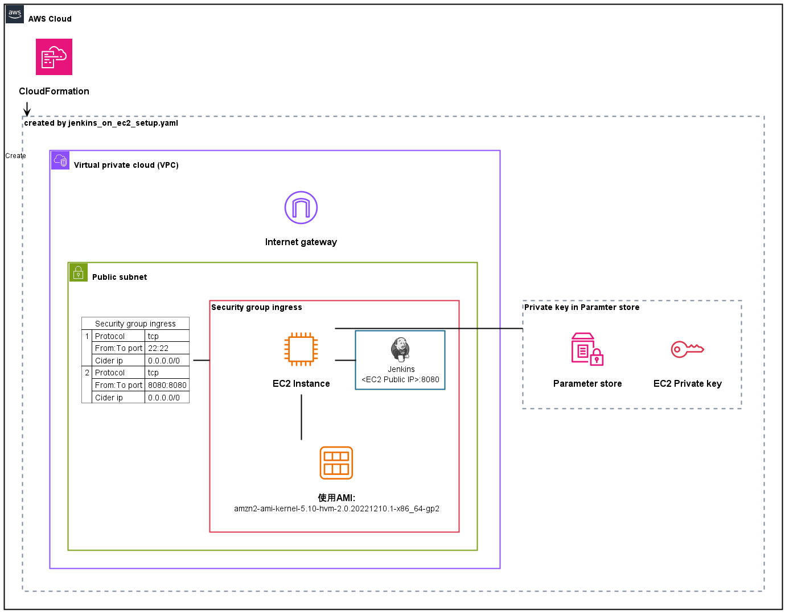

# JenkinsOnEC2

Flutterで作成したアプリケーションを、
Jenkins（EC2上でホスト）を使用し、ビルド＆自動テストするためのCIパイプライン作成手順

## 構成図



## EC2に使用するAMI

- amzn2-ami-kernel-5.10-hvm-2.0.20221210.1-x86_64-gp2

## ファイルの内訳

***

## セットアップ手順

AWS環境を作成し、Jenkinsをセットアップするまでの手順を記載する。

1. スタック作成

```
aws cloudformation create-stack --stack-name JenkinsStack --template-body file://<jenkins_on_ec2_setup.yamlのファイルパス>　--parameters ParameterKey=VpcCIDR,ParameterValue=<VPCのCIDER範囲> ParameterKey=PublicSubnet1CIDR,ParameterValue=<パブリックサブネットのCIDER範囲>
```

2. Jenkinsにアクセスし、初期設定を行う

```
URL: http://<EC2のパブリックIP>:8080/
```

  ### SSH接続手順

  

  Adminパスワードを確認するために、下記手順でSSH接続を行う。

  1. 作成したKeyPairから、EC2にSSH接続

  - [CloudFormationで作成したキーペアを取得＆~/.ssh配下に保存するスクリプト](https://github.com/OrangeJuice652/SaveCloudFormationKeyPair/tree/main)

    - コマンド
    ```
    ./SaveCloudFormationKeyPair/save_cloudformation_keypair.sh JenkinsStack JenkinsInstanceKeyPairID JenkinsInstanceKeyPair
    ```

  - スクリプトを使用しない場合は、~/.ssh配下で、パラメータストア（/ec2/keypair/作成したキーペアID）記載のキー値を保存

  2. EC2にssh接続

  ```
  ssh -i "~/.ssh/<手順2.で作成したキーファイル>" ec2-user@<EC2のパブリックIP>
  ```

***

## Flutterビルド＆AWS Device FarmのフロントテストCIパイプラインの作成

<!-- TODO: 手順記載 -->

## コマンドのメモ

上記にない便利なコマンドのメモ

### スタック削除
```
aws cloudformation delete-stack --stack-name JenkinsStack
```

### Device Farm用のIAMスタックの作成

```
aws cloudformation create-stack --stack-name AWSDeviceFarmUserStack --template-body file://<aws_device_farm_iam_user.yamlのファイルパス> --capabilities CAPABILITY_NAMED_IAM
```

## TODO
- UserDataを別ファイルに分ける
- Flutterビルド＆AWS Device FarmのフロントテストCIパイプラインの作成の手順記載
- Jenkinsの初期設定を自動化し、ブラウザ操作の手順をなくす
  - [参考](https://qiita.com/fuku2014/items/995cf34afd126a627c22f)